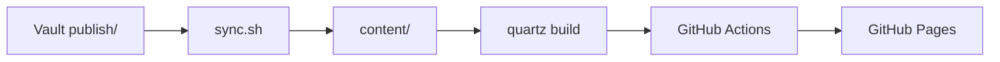

> [!warning] ⚠️ これはテンプレート同梱のサンプルページです
>
> このページは `content/hello-quartz.md`（テンプレートのバンドル）から生成された動作確認用ページです。
>
> **本番公開時は削除または書き換えを推奨**:
> - Vault `publish/` に `hello-quartz.md` を置かなければ、`./sync.sh` 後に自然に消えます
> - テンプレ利用直後で content/ を直接編集している場合は手で削除してください

---

# Hello, Quartz!

Quartz v4 の主要機能が動作しているかを目視確認するためのサンプルページ。

## 確認ポイント

このページが想定どおり表示されていれば、以下が動作しています。

| 機能 | 状態 |
|---|---|
| Markdown レンダリング | この表が見えていれば OK |
| 見出し階層 | H1〜H3 が階層化されて目次に出ていれば OK |
| シンタックスハイライト | 下のコードブロックに色がついていれば OK |
| Mermaid 図 | 下の図がレンダリングされていれば OK |
| サイドバーのフォルダツリー | 左に Explorer が出ていれば OK |
| バックリンク | 右下に「Backlinks」が出ていれば OK |
| 検索 | 左上の検索ボックスからこのページが引けたら OK |
| 内部リンク | 末尾の「トップに戻る」リンクが効けば OK |

## サンプル: コードブロック

```typescript
// Quartz の設定例
const config: QuartzConfig = {
  configuration: {
    pageTitle: "Notes",
    locale: "ja-JP",
  },
}
```

## サンプル: Mermaid 図



## サンプル: リスト

- 順序なしリスト
- 2行目
  - ネスト
  - もうひとつネスト

1. 順序つきリスト
2. 2番目
3. 3番目

## サンプル: 引用

> このサイトは Obsidian Vault の `publish/` フォルダに置いたノートだけを Quartz で静的サイト化して公開している。
>
> ローカル編集 → push → 自動デプロイ、というフロー。

## 内部リンク

- [[index|トップに戻る]]

## 終わりに

このページが期待どおりに見えていれば、テンプレートのセットアップは成功です。あとは Vault `publish/` に好きなノートを追加するだけ。

---

🔁 再掲: **このページは `content/hello-quartz.md` のテンプレートサンプル**です。動作確認専用なので、本番公開時は削除または書き換え推奨。
